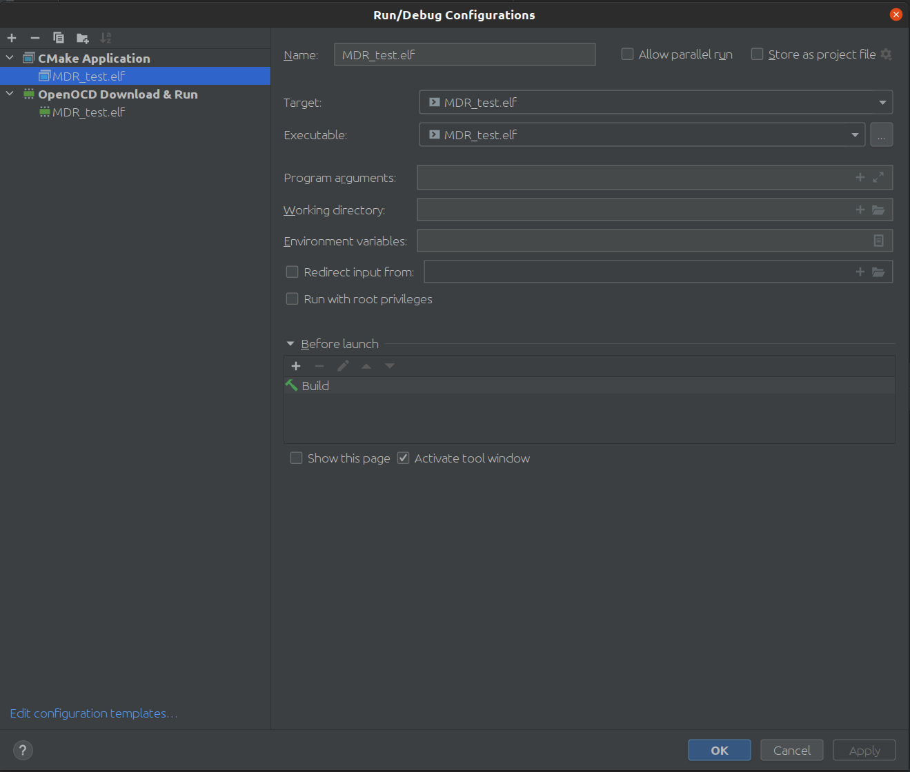
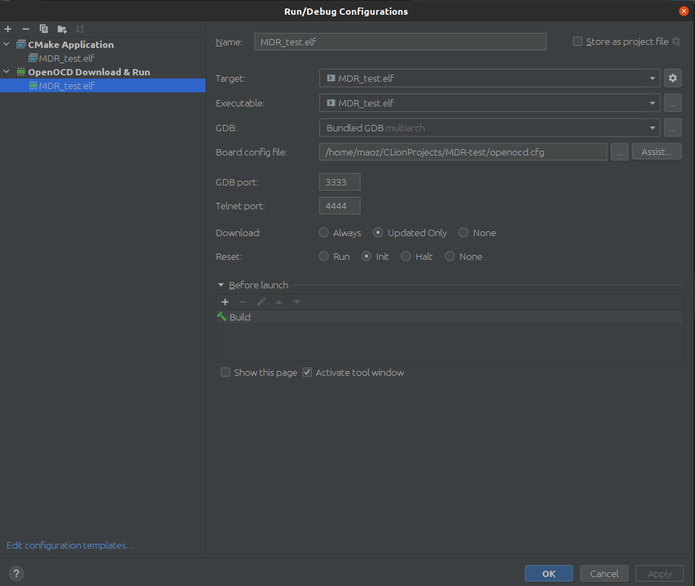
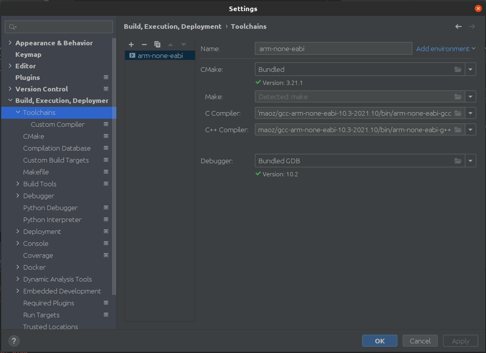

gcc-arm-none-eabi прилагается. Он разбит на части.

Для склеивания частей: cat gcc-arm-none-eabi-10.3-2021.10-x86_64-linux.tar.bz2.part* > gcc-arm-none-eabi-10.3-2021.10-x86_64-linux.tar.bz2

Затем распаковать получившийся архив

В папке SVD Находятся файлы с описанием регистров